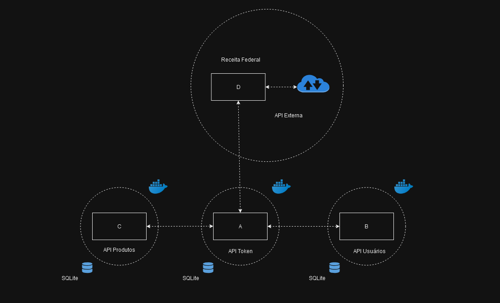

# API de Gerenciamento de Estoque com JWT e Flask

Esta é uma API RESTful para gerenciar usuários, produtos e notas fiscais eletrônicas, com autenticação via tokens JWT. Desenvolvida com Flask, Flask-RESTful e Flask-JWT-Extended, ela oferece funcionalidades essenciais de um sistema de estoque, como cadastro, edição, exclusão e listagem de produtos. Além disso, a API integra dados de notas fiscais eletrônicas para automatizar a entrada de produtos no estoque.
## Funcionalidades

* Autenticação JWT: Tokens JWT para garantir segurança nas rotas protegidas.
* Gerenciamento de usuários: Registro, login, listagem e logout.
* Gerenciamento de produtos: Listagem, criação, edição e exclusão de produtos.
* Integração com notas fiscais: Busca e inserção de produtos via URL de notas fiscais.
* Proteção de rotas: Acesso restrito a rotas sensíveis, garantindo integridade do sistema.

---

## Requisitos

Crie um ambiente virtual para instalar as dependências do projeto:

Windows:
```
python -m venv venv
```
macOS e Linux:
```
python3 -m venv venv
```

Ative o ambiente virtual:

Windows:
```
venv\Scripts\activate
```
macOS e Linux:
```
source venv/bin/activate
```

Instale as dependências do projeto:

```
pip install -r requirements.txt
```

Não esqueça de fazer um arquivo `.env` na pasta raiz.
---

## Configuração

O projeto utiliza um banco de dados SQLite, então não há necessidade de configurações adicionais. Porém, para uso em produção, recomenda-se alterar para um banco de dados mais robusto, como PostgreSQL ou MySQL.

## Funcionalidades
Aqui está a documentação gerada para sua API com base no código fornecido. A estrutura segue o padrão OpenAPI (Swagger), e o esquema apresentado já utiliza o decorador `@app.get` e `@app.post` do Flask OpenAPI.

### **API Documentation**
---

**Title**: API Token  
**Version**: 1.0.0  
**Description**: API para gerenciar acesso.

### **Tags**

- **Documentação**: Seleção de documentação (Swagger)
- **Autentificação**: Rotas para autentificação (Login, Logout)
- **Nota fiscal**: Rota para consultar produtos de nota fiscal (API Externa)
- **Produto**: Rotas para manipulação de produtos
- **Usuário**: Rotas para manipulação de usuários

### **Security Schemes**

**Bearer Token**:
- Type: HTTP
- Scheme: Bearer
- Bearer Format: JWT

---

### **Endpoints**

---

#### **Home**  
`GET /`

**Description**: Redireciona para a documentação da API Swagger.  
**Tags**: Documentação  

---

#### **Login**  
`POST /login`

**Description**: Endpoint para autentificação de usuários. Retorna um token de acesso e o nível de usuário.  
**Tags**: Autentificação  
**Request Body**:  
- login (string) - Obrigatório  
- senha (string) - Obrigatório  

**Response**:  
- **200 OK**: Retorna o login, o token de acesso e o nível de usuário.  
- **400 Bad Request**: Erro ao efetuar o login.  

---

#### **Register**  
`POST /register`

**Description**: Cria um novo usuário.  
**Tags**: Usuário  
**Request Body**:  
- login (string) - Obrigatório  
- senha (string) - Obrigatório  
- nivel (int) - Obrigatório  
- email (string) - Obrigatório  

**Response**:  
- **201 Created**: Usuário criado com sucesso.  
- **400 Bad Request**: Erro ao criar o usuário.  

---

#### **Logout**  
`POST /logout`

**Description**: Faz logout do usuário, invalidando o token.  
**Tags**: Autentificação  
**Response**:  
- **200 OK**: Usuário saiu com sucesso.  
- **500 Server Error**: Erro ao processar o logout.

---

#### **Verificar Token**  
`GET /protected`

**Description**: Verifica se o token JWT é válido ou expirado.  
**Tags**: Autentificação  
**Security**: Bearer Token  
**Responses**:  
- **200 OK**: Token válido.  
- **401 Unauthorized**: Token expirado ou inválido.  

---

#### **Listar Usuários**  
`GET /usuarios`

**Description**: Retorna todos os usuários cadastrados.  
**Tags**: Usuário  
**Security**: Bearer Token  
**Responses**:  
- **200 OK**: Lista de usuários.  
- **401 Unauthorized**: Token inválido ou expirado.  
- **500 Server Error**: Erro interno no servidor.

---

#### **Listar Produtos**  
`GET /produtos`

**Description**: Retorna todos os produtos cadastrados.  
**Tags**: Produto  
**Security**: Bearer Token  
**Responses**:  
- **200 OK**: Lista de produtos.  
- **401 Unauthorized**: Token inválido ou expirado.  
- **500 Server Error**: Erro interno no servidor.

---

#### **Cadastrar Produtos de Nota Fiscal**  
`POST /nota_url`

**Description**: Recebe a URL de uma nota fiscal e cadastra os produtos associados.  
**Tags**: Nota fiscal  
**Request Body**:  
- nota_url (string) - Obrigatório  

**Security**: Bearer Token  
**Responses**:  
- **201 Created**: Produtos cadastrados com sucesso.  
- **400 Bad Request**: O campo 'nota_url' não foi preenchido.  
- **500 Server Error**: Erro ao processar a leitura da nota fiscal.

---

#### **Deletar Produto**  
`DELETE /produto/{id}`

**Description**: Deleta um produto existente.  
**Tags**: Produto  
**Path Parameter**:  
- id (int) - ID do produto a ser deletado.  

**Security**: Bearer Token  
**Responses**:  
- **200 OK**: Produto deletado com sucesso.  
- **404 Not Found**: Produto não encontrado.  
- **500 Server Error**: Erro ao deletar o produto.

---

#### **Atualizar Produto**  
`PUT /produto/{id}`

**Description**: Atualiza as informações de um produto existente.  
**Tags**: Produto  
**Path Parameter**:  
- id (int) - ID do produto a ser atualizado.  

**Request Body**:  
- nome (string) - Nome do produto.  
- descricao (string) - Descrição do produto.  
- preco (float) - Preço do produto.  
- quantidade (int) - Quantidade do produto.  

**Security**: Bearer Token  
**Responses**:  
- **200 OK**: Produto atualizado com sucesso.  
- **404 Not Found**: Produto não encontrado.  
- **500 Server Error**: Erro ao atualizar o produto.

---

## Executando o projeto

Para iniciar o servidor de desenvolvimento, execute:

```
python app.py
```

O servidor será iniciado em `http://localhost:5000`.

---

# Docker

Exemplo genérico.

#### 1. **Instalação do Docker**

**Para Windows e Mac:**
- **Baixe e instale o Docker Desktop**:
  - Acesse o [site do Docker Desktop](https://www.docker.com/products/docker-desktop) e baixe o instalador apropriado para seu sistema operacional.
  - Siga as instruções do instalador. Durante a instalação, pode ser necessário habilitar o WSL 2 (para Windows).

**Para Linux:**
- **Instalação do Docker**:
  - Abra um terminal e execute os seguintes comandos para instalar o Docker:
    ```bash
    sudo apt-get update
    sudo apt-get install -y \
        apt-transport-https \
        ca-certificates \
        curl \
        software-properties-common

    curl -fsSL https://download.docker.com/linux/ubuntu/gpg | sudo apt-key add -
    sudo add-apt-repository "deb [arch=amd64] https://download.docker.com/linux/ubuntu $(lsb_release -cs) stable"
    sudo apt-get update
    sudo apt-get install -y docker-ce
    ```

- **Iniciar o serviço Docker**:
    ```bash
    sudo systemctl start docker
    sudo systemctl enable docker
    ```

- **Verificar se o Docker está rodando**:
    ```bash
    sudo docker run hello-world
    ```

#### 2. **Criar a Estrutura do Projeto**

Agora que o Docker está instalado, você precisa criar a estrutura de pastas para sua aplicação Flask. Execute os seguintes comandos no terminal:

```bash
mkdir minha-app-flask
cd minha-app-flask
touch app.py requirements.txt Dockerfile docker-compose.yml
```

### 3. **Escrever o Código da Aplicação**

Abra o arquivo `app.py` e adicione o seguinte código básico para a aplicação Flask:

```python
from flask import Flask

app = Flask(__name__)

@app.route('/')
def home():
    return "Olá, Docker!"

if __name__ == '__main__':
    app.run(host='0.0.0.0', port=5000)
```

### 4. **Criar o arquivo requirements.txt**

No arquivo `requirements.txt`, adicione a seguinte linha para instalar o Flask:

```
Flask==2.0.3
```

### 5. **Criar o Dockerfile**

No arquivo `Dockerfile`, cole o seguinte código:

```dockerfile
# Usa a imagem base do Python
FROM python:3.9.10-slim-buster

# Define o diretório de trabalho no container
WORKDIR /app

# Copia o arquivo requirements.txt para o diretório de trabalho no container
COPY requirements.txt ./

# Instala as dependências da aplicação
RUN pip install --no-cache-dir -r requirements.txt

# Copia todo o conteúdo do projeto para o diretório de trabalho
COPY . .

# Define o comando para rodar a aplicação
CMD ["python", "app.py"]
```

### 6. **Criar o docker-compose.yml**

No arquivo `docker-compose.yml`, cole o seguinte código:

```yaml
version: '3.5'

services:
  flask-app-service:
    build: .  # Aponta para o diretório atual
    ports:
      - "5000:5000"  # Mapeia a porta 5000 do container para a porta 5000 do host
    environment:
      - PYTHONUNBUFFERED=1  # Para garantir que os logs sejam exibidos em tempo real
```

### 7. **Rodar a Aplicação**

Com todos os arquivos configurados, agora você pode rodar a aplicação Flask com Docker. No terminal, na pasta `minha-app-flask`, execute o seguinte comando:

```bash
docker-compose up --build
```

Esse comando irá:
- Construir a imagem Docker da sua aplicação.
- Iniciar um container executando sua aplicação Flask.

### 8. **Acessar a Aplicação**

Depois que o comando acima for executado, abra o seu navegador e vá para `http://localhost:5000`. Você deve ver a mensagem "Olá, Docker!".


# Estrutura


